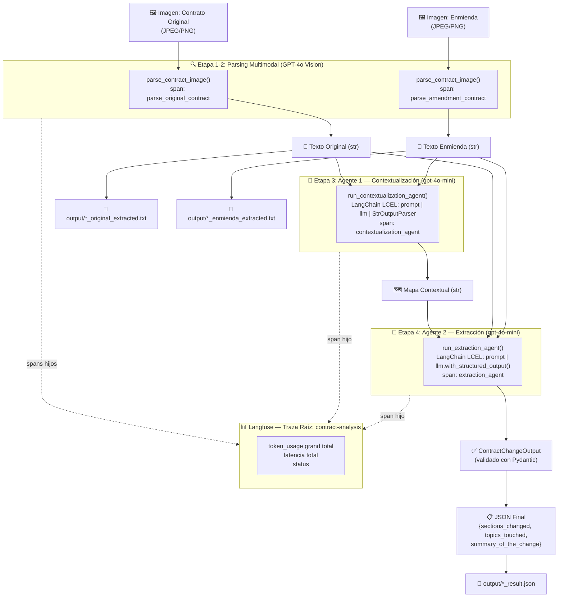
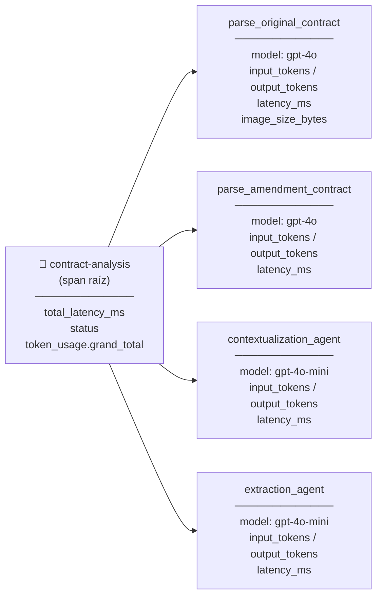
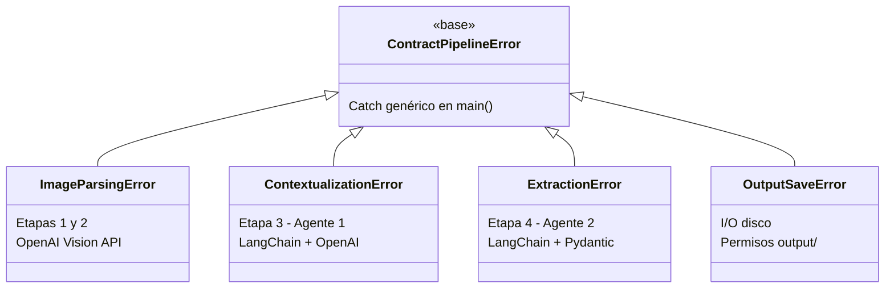

# 🤖 Agente Autónomo de Comparación de Contratos

> Este sistema recibe las imágenes escaneadas de dos documentos contractuales, las lee utilizando IA de visión, y utiliza un equipo de **"analistas virtuales"** (Agentes de IA) para entender el contexto y extraer exactamente qué cláusulas se modificaron, devolviendo un reporte estructurado y sin errores que los sistemas de la empresa pueden procesar automáticamente.

---

## 📋 Índice

1. [Descripción General](#descripción-general)
2. [Arquitectura del Sistema](#arquitectura-del-sistema)
3. [Stack Técnico](#stack-técnico)
4. [Estructura del Proyecto](#estructura-del-proyecto)
5. [Setup e Instalación](#setup-e-instalación)
6. [Uso — CLI](#uso--cli)
7. [Uso — API REST](#uso--api-rest)
8. [Archivos de Salida](#archivos-de-salida)
9. [Observabilidad con Langfuse](#observabilidad-con-langfuse)
10. [Manejo de Errores](#manejo-de-errores)
11. [Decisiones y Justificaciones Técnicas](#decisiones-y-justificaciones-técnicas)

---

## Descripción General

El sistema resuelve un problema recurrente en entornos legales y corporativos: **comparar manualmente dos versiones de un contrato** (original y enmienda) es lento, propenso a errores humanos y no escalable.

El pipeline automatiza el proceso completo en 4 etapas secuenciales:

| Etapa | Responsable | Output |
|---|---|---|
| 1 & 2 | GPT-4o Vision | Texto extraído de cada imagen |
| 3 | Agente 1 (Contextualización) | Mapa estructural comparado |
| 4 | Agente 2 (Extracción) | JSON validado con los cambios |

---

## Arquitectura del Sistema

### Flujo del Pipeline



### Estructura de Trazas en Langfuse

```
contract-analysis  (span raíz)
├── parse_original_contract   (span) → GPT-4o Vision
├── parse_amendment_contract  (span) → GPT-4o Vision
├── contextualization_agent   (span) → gpt-4o-mini
└── extraction_agent          (span) → gpt-4o-mini
```

Cada span registra: `input`, `output (preview)`, `latencia (ms)`, `token_usage`, `model`, `status`.
La traza raíz consolida el **grand total de tokens** sumando todos los spans hijos.

---

## Stack Técnico

| Componente | Tecnología | Versión | Rol |
|---|---|---|---|
| **Vision / Parsing** | OpenAI GPT-4o (`responses.create`) | `openai >= 2.29` | Extrae texto de imágenes de contratos |
| **Agentes** | LangChain LCEL (`ChatOpenAI`) | `langchain-openai` | Orquesta los dos agentes analistas |
| **Validación** | Pydantic v2 (`BaseModel`) | `pydantic >= 2.12` | Valida el schema del output final |
| **Observabilidad** | Langfuse v4 (OpenTelemetry) | `langfuse >= 4.0` | Traza completa de cada ejecución |
| **API REST** | FastAPI + Uvicorn | `fastapi`, `uvicorn[standard]` | Expone el pipeline como servicio HTTP |
| **Entorno** | python-dotenv | `python-dotenv >= 1.2` | Carga segura de API keys |
| **Lenguaje** | Python 3.14 | — | Base del sistema |

### Modelos utilizados

| Tarea | Modelo | Justificación |
|---|---|---|
| Parsing de imágenes | `gpt-4o` | Máxima capacidad de visión para extraer texto legal de imágenes escaneadas |
| Agente 1 (Contextualización) | `gpt-4o-mini` | Tarea de análisis de texto: no requiere Vision, costo optimizado |
| Agente 2 (Extracción) | `gpt-4o-mini` | Ídem, con structured output para garantizar JSON válido |

---

## Estructura del Proyecto

```
ai_engineering-M4_Project/
│
├── .env                          # API keys (no incluir en git)
├── .env.example                  # Plantilla de variables de entorno
├── IMPLEMENTATION_PLAN.md        # Plan de diseño técnico del sistema
├── INSTRUCCIONES_ORIGINALES.md   # Consigna original del proyecto
│
├── data/
│   └── test_contracts/           # Imágenes de contratos de prueba
│       ├── documento_1__original.jpg
│       ├── documento_1__enmienda.jpg
│       ├── documento_2__original.jpg
│       ├── documento_2__enmienda.jpg
│       ├── documento_3__original.jpg
│       └── documento_3__enmienda.jpg
│
├── output/                       # Archivos generados por el pipeline (auto-creado)
│   ├── documento_1__original_extracted.txt
│   ├── documento_1__enmienda_extracted.txt
│   └── documento_1_result.json
│
└── src/
    ├── __init__.py
    ├── pipeline.py               # Lógica central del pipeline (compartida por CLI y API)
    ├── main.py                   # Punto de entrada CLI
    ├── api.py                    # Servidor FastAPI (REST API)
    ├── models.py                 # Schema Pydantic: ContractChangeOutput
    ├── image_parser.py           # Parsing Vision con GPT-4o + Langfuse spans
    ├── exceptions.py             # Jerarquía de excepciones personalizadas
    └── agents/
        ├── __init__.py
        ├── contextualization_agent.py   # Agente 1: análisis comparativo de estructura
        └── extraction_agent.py          # Agente 2: extracción y clasificación de cambios
```

---

## Setup e Instalación

### 1. Prerrequisitos

- Python 3.10+
- Cuenta en [OpenAI](https://platform.openai.com/) con acceso a `gpt-4o`
- Cuenta en [Langfuse](https://langfuse.com/) (gratuita)

### 2. Clonar y configurar entorno virtual

```bash
# Crear entorno virtual
python -m venv .venv
source .venv/bin/activate        # macOS/Linux
# .venv\Scripts\activate         # Windows

# Instalar dependencias del pipeline
pip install openai langchain langchain-openai langfuse pydantic python-dotenv

# Instalar dependencias adicionales para la API REST
pip install fastapi "uvicorn[standard]" python-multipart
```

### 3. Configurar variables de entorno

Copiá el archivo de ejemplo y completá con tus credenciales:

```bash
cp .env.example .env
```

```env
# .env
OPENAI_API_KEY=sk-...           # Tu API key de OpenAI
OPENAI_MODEL=gpt-4o-mini        # Modelo default (referencial)

LANGFUSE_SECRET_KEY=sk-lf-...   # Secret key de Langfuse
LANGFUSE_PUBLIC_KEY=pk-lf-...   # Public key de Langfuse
LANGFUSE_BASE_URL=https://us.cloud.langfuse.com
```

> ⚠️ **Nunca commitees el archivo `.env` al repositorio.** Está incluido en `.gitignore`.

---

## Uso — CLI

### Ejecución básica (par de documentos por defecto)

Procesa `documento_1__original.jpg` y `documento_1__enmienda.jpg`:

```bash
python src/main.py
```

### Ejecución con imágenes específicas

```bash
python src/main.py data/test_contracts/documento_2__original.jpg \
                   data/test_contracts/documento_2__enmienda.jpg
```

### Output en consola

```
============================================================
  SISTEMA DE ANÁLISIS DE CONTRATOS — Pipeline Iniciado
============================================================
  📄 Contrato original : documento_2__original.jpg
  📝 Enmienda          : documento_2__enmienda.jpg
============================================================

🔍 [Etapa 1/4] Parseando contrato original con GPT-4o Vision...
🔍 [Etapa 2/4] Parseando enmienda con GPT-4o Vision...
🤖 [Etapa 3/4] Agente 1: construyendo mapa contextual...
🤖 [Etapa 4/4] Agente 2: extrayendo y estructurando cambios...
   ✅ Pipeline completado.

============================================================
  📋 RESULTADO FINAL (validado por Pydantic)
============================================================
{
  "sections_changed": ["Alcance del Servicio", "Duración", "Honorarios", ...],
  "topics_touched": ["alcance de servicios", "duración", "honorarios", ...],
  "summary_of_the_change": "1. **ADICIÓN:** Se introduce una nueva cláusula..."
}
============================================================

💾 Archivos guardados en output/:
   📄 documento_2__original_extracted.txt
   📄 documento_2__enmienda_extracted.txt
   📋 documento_2_result.json

✅ Pipeline completado exitosamente.
   → https://us.cloud.langfuse.com
```

---

## Uso — API REST

El sistema también puede ser consumido como un servicio HTTP. La API está construida con **FastAPI** y expone el mismo pipeline a través de un endpoint `POST`.

### 1. Levantar el servidor

```bash
# Desde la raíz del proyecto, con el entorno virtual activado:
uvicorn src.api:app --reload --port 8000
```

```
INFO:     Uvicorn running on http://127.0.0.1:8000 (Press CTRL+C to quit)
INFO:     Started reloader process
INFO:     Application startup complete.
```

> **`--reload`** reinicia el servidor automáticamente al modificar el código fuente. Omitirlo en producción.

---

### 2. Endpoints disponibles

| Método | Endpoint | Descripción |
|---|---|---|
| `GET` | `/` | Información del servicio y lista de endpoints |
| `GET` | `/health` | Health check |
| `POST` | `/api/v1/analyze` | **Analiza un par de contratos** |
| `GET` | `/docs` | Swagger UI (interfaz interactiva) |
| `GET` | `/redoc` | ReDoc (documentación alternativa) |

---

### 3. `GET /health` — Health check

```bash
curl http://localhost:8000/health
```

```json
{ "status": "ok", "service": "contract-analysis-api" }
```

---

### 4. `POST /api/v1/analyze` — Analizar contratos

Recibe dos imágenes como `multipart/form-data` y devuelve el JSON con los cambios detectados.

#### Campos del request

| Campo | Tipo | Requerido | Descripción |
|---|---|---|---|
| `original` | `file` (JPEG/PNG) | ✅ | Imagen del contrato original |
| `amendment` | `file` (JPEG/PNG) | ✅ | Imagen de la enmienda |
| `save_files` | `bool` (query param) | ❌ | `true` (default): guarda `.txt` y `.json` en `output/`. `false`: solo devuelve el JSON. |

#### Ejemplo con `curl` — guardando archivos (comportamiento por defecto)

```bash
curl -X POST http://localhost:8000/api/v1/analyze \
  -F "original=@data/test_contracts/documento_1__original.jpg" \
  -F "amendment=@data/test_contracts/documento_1__enmienda.jpg"
```

#### Ejemplo con `curl` — sin guardar archivos en disco

```bash
curl -X POST "http://localhost:8000/api/v1/analyze?save_files=false" \
  -F "original=@data/test_contracts/documento_1__original.jpg" \
  -F "amendment=@data/test_contracts/documento_1__enmienda.jpg"
```

#### Respuesta exitosa `200 OK`

```json
{
  "sections_changed": [
    "Otorgamiento de Licencia",
    "Plazo",
    "Pago",
    "Soporte",
    "Terminación",
    "Protección de Datos"
  ],
  "topics_touched": [
    "plazos",
    "precio",
    "soporte",
    "terminación",
    "protección de datos"
  ],
  "summary_of_the_change": "1. **MODIFICACIÓN:** En 'Plazo' se extiende de 12 a 24 meses...\n2. **ADICIÓN:** Se introduce una nueva cláusula 'Protección de Datos'..."
}
```

#### Respuestas de error

| Código | Cuándo ocurre |
|---|---|
| `422` | Archivo no es JPEG/PNG, o el modelo no pudo extraer texto de la imagen |
| `500` | Error en algún agente (OpenAI, LangChain, Pydantic) |

```json
{
  "detail": {
    "error":   "ImageParsingError",
    "message": "❌ Error al llamar a la API de OpenAI Vision...",
    "stage":   "image_parsing",
    "hint":    "Verificá que las imágenes sean JPEG/PNG legibles."
  }
}
```

---

### 5. Swagger UI — Interfaz visual interactiva

FastAPI genera automáticamente una interfaz para explorar y probar los endpoints sin necesidad de `curl`.

**URL:** [`http://localhost:8000/docs`](http://localhost:8000/docs)

Desde Swagger UI podés:
- Ver la descripción completa de cada endpoint
- Subir las imágenes directamente desde el navegador usando el botón **"Try it out"**
- Probar el query param `save_files` con un checkbox
- Ver el schema de la respuesta (`ContractChangeOutput`)

---

### 6. Ejemplo desde Python (`requests`)

```python
import requests

url = "http://localhost:8000/api/v1/analyze"

with open("original.jpg", "rb") as orig, open("enmienda.jpg", "rb") as amend:
    response = requests.post(
        url,
        files={
            "original":  ("original.jpg",  orig,  "image/jpeg"),
            "amendment": ("enmienda.jpg", amend, "image/jpeg"),
        },
        params={"save_files": True},
    )

result = response.json()
print(result["summary_of_the_change"])
```

---

### 7. Notas de uso

- **Tiempo de respuesta**: 30–60 segundos (el endpoint es síncrono, el pipeline llama a OpenAI en cada etapa).
- **Concurrencia**: Uvicorn maneja múltiples requests en paralelo usando un thread pool. Para uso interno o baja concurrencia es suficiente.
- **Archivos temporales**: los `UploadFile` se guardan en archivos temporales durante el procesamiento y se eliminan automáticamente al terminar (con o sin error).

---

## Archivos de Salida

El pipeline crea automáticamente la carpeta `output/` y genera **3 archivos por corrida**, con nombres derivados de las imágenes de entrada:

| Archivo | Contenido |
|---|---|
| `<doc>__original_extracted.txt` | Texto extraído del contrato original por GPT-4o Vision |
| `<doc>__enmienda_extracted.txt` | Texto extraído de la enmienda |
| `<doc>_result.json` | JSON final validado por Pydantic con los cambios |

> Si se repite la corrida con los mismos archivos, los outputs se **sobreescriben**.

### Ejemplo de `result.json`

```json
{
  "sections_changed": [
    "Alcance del Servicio",
    "Duración",
    "Honorarios",
    "Propiedad Intelectual"
  ],
  "topics_touched": [
    "alcance de servicios",
    "duración",
    "honorarios",
    "propiedad intelectual"
  ],
  "summary_of_the_change": "1. **ADICIÓN:** Se introduce una nueva cláusula 'Propiedad Intelectual'... 2. **MODIFICACIÓN:** En 'Duración' se cambia de 6 a 9 meses... 3. **MODIFICACIÓN:** La tarifa mensual sube de USD 8.000 a USD 9.500..."
}
```

### Schema Pydantic (`ContractChangeOutput`)

```python
class ContractChangeOutput(BaseModel):
    sections_changed: List[str]   # Secciones/cláusulas modificadas
    topics_touched:   List[str]   # Categorías legales/comerciales afectadas
    summary_of_the_change: str    # Descripción detallada (ADICIÓN/ELIMINACIÓN/MODIFICACIÓN)
```

---

## Observabilidad con Langfuse

Cada ejecución del pipeline queda completamente trazada en [Langfuse](https://us.cloud.langfuse.com).

### Estructura de la traza



### Token usage consolidado en la traza raíz

La traza raíz `contract-analysis` incluye en su metadata el **desglose por etapa y el grand total acumulado** de tokens de todo el pipeline:

```json
"token_usage": {
  "parse_original_contract":  { "input_tokens": 1200, "output_tokens": 350, "total_tokens": 1550 },
  "parse_amendment_contract": { "input_tokens": 1200, "output_tokens": 420, "total_tokens": 1620 },
  "contextualization_agent":  { "input_tokens": 2100, "output_tokens": 890, "total_tokens": 2990 },
  "extraction_agent":         { "input_tokens": 3500, "output_tokens": 650, "total_tokens": 4150 },
  "grand_total":              { "input_tokens": 8000, "output_tokens": 2310, "total_tokens": 10310 }
}
```

---

## Manejo de Errores

El sistema usa una jerarquía de excepciones tipadas que permite identificar el origen exacto de cada falla:



Cuando ocurre un error, el sistema:
1. **Marca el span de Langfuse** con `level="ERROR"` y un `status_message` descriptivo
2. **Imprime un mensaje claro** con el tipo de error y sugerencias de resolución
3. **Termina con `sys.exit(1)`** para que los sistemas externos puedan detectar el fallo

### Ejemplo de output en error de parsing

```
============================================================
  ⚠️  ERROR EN PARSING DE IMAGEN
============================================================
❌ Error al llamar a la API de OpenAI Vision para 'documento_1__original.jpg':
   AuthenticationError: Incorrect API key provided.

💡 Sugerencias:
   • Verificá que la imagen no esté corrupta
   • Aseguráte de que OPENAI_API_KEY es válida en el archivo .env
   • Confirmá que la imagen sea un contrato legible (JPEG/PNG)
```

---

## Decisiones y Justificaciones Técnicas

### 1. OpenAI Responses API para Vision (no `chat.completions`)

Se usa `client.responses.create()` (Responses API) en lugar de `chat.completions.create()` para el parsing de imágenes porque:
- Soporta el tipo `input_image` con imagen en base64 de forma nativa
- Es la API recomendada por OpenAI para pipelines multimodales modernos
- Permite mezclar `input_text` e `input_image` en el mismo turno de usuario

### 2. LangChain LCEL para los Agentes (no AgentExecutor)

Se usa el patrón moderno de **LangChain Expression Language (LCEL)** (`prompt | llm | parser`) porque:
- Es el patrón oficial y recomendado desde LangChain v0.2
- Es más legible, componible y testeable que `AgentExecutor`
- Permite insertar fácilmente steps intermedios (ej: separar `llm` del parser para capturar `usage_metadata`)

### 3. `with_structured_output(include_raw=True)` en el Agente 2

El Agente 2 usa `llm.with_structured_output(ContractChangeOutput, include_raw=True)` porque:
- `with_structured_output` garantiza que el LLM produzca JSON compatible con el schema Pydantic (via tool calling)
- `include_raw=True` retorna además el `AIMessage` original, que contiene `usage_metadata` con los tokens consumidos
- Sin `include_raw=True` sería imposible capturar el token usage en structured output chains

### 4. Chain separada en el Agente 1 (`prompt | llm` sin parser)

El Agente 1 separa deliberadamente la chain en dos pasos:

```python
ai_message = (prompt | llm).invoke({...})   # captura usage_metadata
context_map = StrOutputParser().invoke(ai_message)
```

Si se usara `prompt | llm | StrOutputParser`, el `AIMessage` sería consumido internamente por el parser y se perdería el acceso a `usage_metadata`.

### 5. Langfuse v4 con API OpenTelemetry

Se usa Langfuse v4 (que internamente usa OpenTelemetry) en lugar de la API legacy (`langfuse.trace()` / `.span()`). Las razones:
- La API v4 es la única disponible en `langfuse >= 4.0`
- Usa `start_as_current_observation()` como context manager: los spans hijos se crean automáticamente dentro del contexto activo sin necesidad de pasar el objeto trace explícitamente
- `as_type="span"` para todos los nodos del árbol (incluyendo la raíz)

### 6. Token Usage acumulado en la traza raíz

El grand total de tokens se calcula en `run_pipeline()` sumando los `token_usage` retornados por cada función. Esto requirió que las funciones retornen **tuples** `(output, token_usage)` en lugar de solo el output. La ventaja:
- Un único lugar (`main.py`) concentra la lógica de acumulación
- El dashboard de Langfuse muestra el costo total del pipeline en un solo nodo
- Facilita el monitoreo de costos por corrida

### 7. Jerarquía de excepciones personalizadas

Se creó `src/exceptions.py` con una jerarquía tipada en lugar de usar excepciones genéricas porque:
- Permite hacer catching selectivo en `main.py` con mensajes diferenciados por etapa
- Los errores de OpenAI, LangChain y Pydantic tienen contextos y sugerencias de resolución distintos
- Se puede hacer `except ContractPipelineError` como catch genérico si el caller no necesita distinguir

### 8. Archivos de Output con naming derivado de las imágenes

Los nombres de salida se derivan automáticamente del prefijo común entre los stems de las imágenes (`os.path.commonprefix`). Esto garantiza:
- Trazabilidad directa entre input y output sin configuración manual
- Los archivos de pares distintos no se pisan entre sí (`documento_1_result.json` vs `documento_2_result.json`)
- Las re-ejecuciones con los mismos inputs sobreescriben los mismos archivos (idempotencia)

---

## Variables de Entorno

| Variable | Descripción | Requerida |
|---|---|---|
| `OPENAI_API_KEY` | API key de OpenAI | ✅ |
| `OPENAI_MODEL` | Modelo por defecto (referencial) | ❌ |
| `LANGFUSE_SECRET_KEY` | Secret key del proyecto Langfuse | ✅ |
| `LANGFUSE_PUBLIC_KEY` | Public key del proyecto Langfuse | ✅ |
| `LANGFUSE_BASE_URL` | URL del servidor Langfuse | ✅ |

---

*Sistema desarrollado como proyecto M4 del curso de AI Engineering.*
